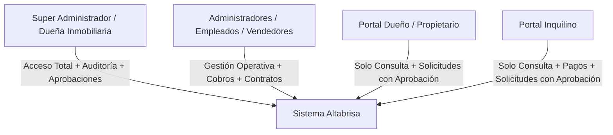

# 🏢 Sistema de Gestión Inmobiliaria y Residencial - Altabrisa

Documento oficial de especificación funcional, técnica y operativa para el desarrollo del software de gestión residencial e inmobiliaria del complejo **Apartamentos Altabrisa** (Villa Canales, Guatemala).

* **Plan Maestro Técnico:** [PLAN_DE_PROYECTO_ALTABRISA.md](file:///d:/ATLAS/Marcas/ALTABRISAS/PLAN_DE_PROYECTO_ALTABRISA.md)
* **Arquitectura Base:** [Keystone Arquitectura 2 - Sistemas](https://github.com/vmcifuentesb/arquitecturas-estandar-proyectos-keystone/tree/main/estandar-arquitectura-paginas-web-check/Arquitectura%202%20-%20Sistemas)
* **Estándar de Diseño:** [UI/UX Pro Max Skill](https://ui-ux-pro-max-skill.nextlevelbuilder.io/)
* **Metodología de Desarrollo:** [GitHub Spec-Kit (Spec-Driven Development)](https://github.com/github/spec-kit)

---

## 1. Información General y Recursos del Proyecto Altabrisa

* **Ubicación:** Km 24, Calle Principal, Caserío La Virgen 1-10, Zona 2, Villa Canales, Guatemala.
* **Desarrollador / Comercializador:** Arte Inmobiliario / Inmobiliaria Altabrisa.
* **Portal Web Oficial:** [Arte Inmobiliario - Altabrisa](https://www.arteinmobiliario.com.gt/altabrisa/)
* **Página de Facebook:** [Apartamentos Altabrisa](https://www.facebook.com/p/Apartamentos-Altabrisa-100083363739322/?locale=es_LA)
* **Documentación Técnica:** [Información Altabrisa - Scribd](https://es.scribd.com/document/505666635/Informacion-Altabrisa-1)
* **Escala y Dimensiones del Proyecto (Fase Operativa Activa):**
  * **10 Torres / Módulos Residenciales:**
    * **Sector A:** `Torre A1`, `Torre A2`, `Torre A3`, `Torre A4`, `Torre A5`
    * **Sector B:** `Torre B1`, `Torre B2`
    * **Sector C:** `Torre C1`, `Torre C2`
    * **Sector D:** `Torre D1`, `Torre D2`
  * **Apartamentos:** Distribución estándar de 4 a 6 niveles por torre (promedio de 24 unidades por torre), identificados por Torre, Nivel y Número (ej. `A1-101`, `B2-304`).
  * *(Capacidad de expansión arquitectónica para fases futuras hasta las 34 torres del master plan).*
* **Modelos de Apartamentos Oficiales:**
  * **Modelo Roma (20 - 21 m²):** 1 dormitorio, 1 baño completo, cocineta.
  * **Modelo Milán (45 m²):** 2 habitaciones, 1 baño completo, sala-comedor, cocina.
  * **Modelo Turín (60 m²):** 2 a 3 habitaciones o estudio/lavandería, 1 baño completo, sala-comedor, cocina.
* **Amenidades del Complejo:** Garita de seguridad privada 24/7, pozo propio de agua potable, piscina, canchas polideportivas, quiosco para eventos y estacionamientos asignados.
* **Identidad Visual y Paleta Corporativa:**
  * **Terracota / Naranja Altabrisa:** `#EE7200` / `#D27406`
  * **Acento / Aqua:** `#16B6A9`
  * **Alerta / Mora:** `#D20906`
  * **Slate / Fondo Oscuro:** `#1E293B` / `#383838`
  * **Blanco / Superficies Claras:** `#FFFFFF` / `#F8FAFC`
* **Recursos Gráficos Disponibles (`assets/`):**
  * `assets/branding/logo-altabrisa.png`: Logotipo oficial Altabrisa.
  * `assets/branding/logo-arte-inmobiliario.png`: Logotipo desarrolladora.
  * `assets/images/`: Planos de distribución de modelos Roma y Milán, renders y fotografías de áreas comunes y torres.

---

## 2. Arquitectura de Usuarios y Roles de Acceso

### 2.1. Super Administrador (Dueña de la Inmobiliaria)
* Control total del sistema y configuración global.
* Tablero financiero con KPIs estratégicos (ingresos del mes, tasa de ocupación, morosidad total y proyección de flujos).
* Creación y gestión de cuentas de empleados, dueños e inquilinos.
* Aprobación o rechazo de solicitudes de actualización de perfil/datos personales.
* Modificación de términos contractuales y asignación de unidades.

### 2.2. Administradores / Empleados (Vendedores y Gestores)
* Mapa interactivo de torres con filtros rápidos y disponibilidad en tiempo real.
* Registro y validación de comprobantes de pago bancarios (boletas/transferencias).
* Carga de documentación y contratos escaneados.
* Envío de recordatorios y gestión de estados de mora y mantenimientos.

### 2.3. Portal Propietario (Dueño del Apartamento)
* **Creación:** Cuenta generada exclusivamente por la administración al adquirir o registrar un apartamento.
* **Nivel de acceso:** Modo consulta (solo lectura de su propiedad).
* **Funciones:**
  * Ver estado de su(s) apartamento(s) y datos del inquilino actual.
  * Visualizar plan de financiamiento histórico (Hipoteca FHA/Banco, Préstamo directo, Contado).
  * Control del estado de la cuota de mantenimiento y servicios.
  * Consulta de contratos y documentación asociada.
  * Buzón de solicitudes de cambio de datos (sujeto a aprobación administrativa).

### 2.4. Portal Inquilino
* **Creación:** Cuenta generada exclusivamente por la administración al suscribir un contrato de arrendamiento.
* **Nivel de acceso:** Modo consulta + carga de comprobantes.
* **Funciones:**
  * Ver contrato vigente de 6 meses y contador regresivo de vencimiento.
  * Desglose de cobros mensuales (alquiler, mantenimiento, agua, luz, internet).
  * Carga de boletas bancarias / transferencias con captura de comprobante.
  * Historial de pagos y recibos digitales descargables.
  * Reporte de consultas o incidencias de mantenimiento.
  * Solicitudes de cambio de datos personales (sujeto a aprobación).

---

## 3. Módulos Funcionales del Sistema

### Módulo 1: Visualizador y Mapa Interactivo por Torres
* **Organización:** Jerarquía visual organizada por las 10 Torres Activas (`A1, A2, A3, A4, A5, B1, B2, C1, C2, D1, D2`).
* **Semáforo de Estados en Vivo:**
  * 🟢 **Disponible:** Unidad lista para venta o renta.
  * 🔵 **Alquilado (Al día):** Contrato activo y pagos al día.
  * 🟡 **Próximo a Vencer (< 30 días):** Alerta activa de renovación de contrato de 6 meses.
  * 🔴 **En Mora:** Cuota de renta o mantenimiento vencida.
  * ⚪ **Mantenimiento / Reservado.**
* **Filtros Multicriterio:** Por Torre, Nivel/Piso, Modelo (Roma/Milán/Turín), Estado, Propietario o Inquilino.
* **Quick-View Modal:** Ficha flotante al hacer clic en una unidad con datos clave, botones directos de llamada/WhatsApp y acceso al expediente completo.

### Módulo 2: Ficha Técnica 360° e Historial del Apartamento
* **Datos Físicos:** Torre, Nivel, No. Unidad, Modelo, m², No. de Parqueo.
* **Servicios e Instalaciones:** No. de Contador de Luz (EEGSA), No. de Contador de Agua Potable, Proveedor y velocidad de Internet, Cuota de mantenimiento mensual (Q).
* **Perfil Financiero del Propietario:**
  * Modalidad de compra: *Contado / Crédito Hipotecario Banco / FHA / Préstamo directo*.
  * Fecha de compra, plazo (años), cuota mensual bancaria, saldo estimado.
* **Línea de Tiempo Histórica:** Registro histórico de inquilinos anteriores, precios de arrendamiento pasados, incidencias resueltas y registro de pagos.

### Módulo 3: Directorio de Personas y Gestión de Clientes
* **Campos Completos:**
  * Nombre completo y fotografía/avatar.
  * DPI / DNI.
  * NIT (para emisión de recibos y facturación en Guatemala).
  * Teléfono principal (con enlace directo `wa.me` de WhatsApp con plantilla dinámica).
  * Teléfono secundario.
  * Correo electrónico.
  * Dirección fiscal / alternativa.
  * Contacto de emergencia.
* **Buzón de Solicitudes de Cambio de Perfil:**
  * Toda edición solicitada por un Propietario o Inquilino entra a una cola de auditoría con botones **[Aprobar Cambio]** o **[Rechazar]**.

### Módulo 4: Sistema de Contratos Duales y Motor de Renovación a 6 Meses
* **Doble Relación Contractual por Apartamento:**
  1. *Contrato Propietario-Inmobiliaria:* Administración, compraventa o mandato.
  2. *Contrato Inquilino-Inmobiliaria:* Arrendamiento residencial estandarizado a plazo de **6 meses**.
* **Motor Automatizado de Renovación:**
  * **Disparador 30 días antes:** El sistema detecta contratos a vencer en 30 días y genera una notificación preventiva automática para Inquilino y Propietario.
  * Opciones de flujo: *(a) Renovar por 6 meses más con un clic, (b) Ajuste de renta, (c) Notificación de desocupación y entrega de inmueble*.
* **Bóveda de Documentos Digitales:**
  * Almacenamiento seguro de contratos firmados en PDF, fotos de DPI, boletas de solvencia y actas de entrega.

### Módulo 5: Facturación, Pagos, Comprobantes y Servicios
* **Conceptos de Cobro Independientes:**
  1. Alquiler mensual.
  2. Cuota de mantenimiento Altabrisa.
  3. Servicios (Agua, Luz EEGSA, Internet).
  4. Registro de cuota hipotecaria del dueño (para control interno de rentabilidad).
* **Carga y Validación de Comprobantes Bancarios:**
  * Registro de boletas de Banrural, Banco Industrial (BI), BAC Credomatic, Banco G&T Continental, etc.
  * Flujo de verificación: *Pendiente $\rightarrow$ Verificado/Aprobado $\rightarrow$ Recibo Digital Generado*.

### Módulo 6: Motor de Notificaciones y Recordatorios
* **Reglas de Automatización:**
  * **5 días antes:** Recordatorio preventivo amigable con enlace y monto.
  * **Día de corte/vencimiento:** Recordatorio de fecha límite.
  * **3 días después:** Notificación de pago vencido / recargo por mora.
  * **30 días antes del fin de contrato:** Notificación de renovación de arrendamiento semestral.
* **Canales:**
  * Plantillas automáticas de WhatsApp vía enlace directo inteligente (`wa.me`) o API.
  * Notificaciones automáticas por Correo Electrónico.
  * Centro de notificaciones dentro de la aplicación.
