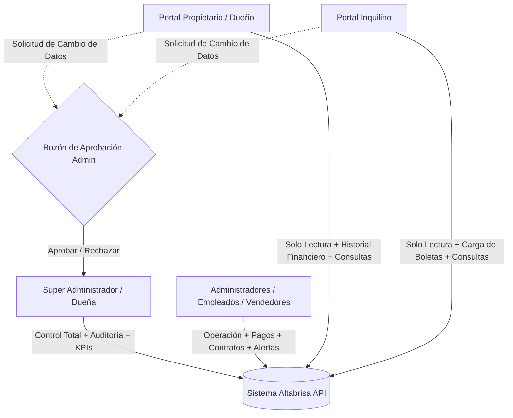
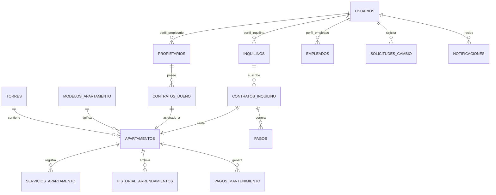

# 📋 Plan Maestro de Proyecto: Software Inmobiliario Altabrisa

Documento integral y oficial de especificación técnica, arquitectura de software, lineamientos de diseño UI/UX, metodología de desarrollo y hoja de ruta para la construcción del sistema de gestión residencial y administrativa del complejo **Apartamentos Altabrisa** (Villa Canales, Guatemala).

---

## 1. Fuentes de Información, Repositorios y Estándares Oficiales

Este proyecto se rige por los siguientes estándares técnicos, metodologías y referencias oficiales:

### 1.1. Información Oficial y Recursos del Inmueble
* **Portal Oficial del Complejo:** [Arte Inmobiliario - Altabrisa](https://www.arteinmobiliario.com.gt/altabrisa/)
* **Página Oficial de Facebook:** [Apartamentos Altabrisa en Facebook](https://www.facebook.com/p/Apartamentos-Altabrisa-100083363739322/?locale=es_LA)
* **Documentación Técnica y Planos:** [Información Altabrisa - Scribd](https://es.scribd.com/document/505666635/Informacion-Altabrisa-1)
* **Bóveda de Recursos Locales:** `assets/branding/` (Logotipos de Altabrisa y desarrolladora) y `assets/images/` (Planos de modelos Roma/Milán y fotografías de áreas comunes y torres).

### 1.2. Repositorio de Arquitectura Base
* **Estándar Keystone Oficial:** [Keystone Arquitecturas - Arquitectura 2: Sistemas](https://github.com/vmcifuentesb/arquitecturas-estandar-proyectos-keystone/tree/main/estandar-arquitectura-paginas-web-check/Arquitectura%202%20-%20Sistemas)
* **Stack Tecnológico:** Monorepo desacoplado con **Docker**, **Backend API REST en Laravel 11 con Laravel Sanctum**, **Frontend en React + Tailwind CSS**, base de datos **PostgreSQL 16**, caché con **Redis** y motor de búsqueda **Meilisearch**.

### 1.3. Estándar de Diseño de Interfaz y Usabilidad (UI/UX)
* **Sistema Rector:** [UI/UX Pro Max Skill](https://ui-ux-pro-max-skill.nextlevelbuilder.io/) | Repositorio: [nextlevelbuilder/ui-ux-pro-max-skill](https://github.com/nextlevelbuilder/ui-ux-pro-max-skill)
* **Aplicación en Altabrisa:** Patrón *Enterprise SaaS Dashboard*, layouts en *Bento Grid*, semáforos de estado en tiempo real, visualizador interactivo de torres 2D, accesibilidad WCAG y paleta corporativa oficial:
  * **Brand / Terracota:** `#EE7200` (Hover: `#D27406`)
  * **Success / Turquesa Aqua:** `#16B6A9` (Disponible / Al día)
  * **Warning / Ámbar:** `#F59E0B` (Contrato por vencer < 30 días)
  * **Danger / Mora:** `#D20906` (Pago vencido / Moroso)
  * **Dark Slate Base:** `#1E293B` / `#0F172A`
  * **Light Canvas:** `#F8FAFC` / `#FFFFFF`

### 1.4. Metodología de Especificación y Desarrollo
* **Marco de Trabajo:** [GitHub Spec-Kit (Spec-Driven Development)](https://github.com/github/spec-kit)
* **Principio Operativo:** Desarrollo guiado por especificaciones ejecutables, garantizando que cada regla de negocio, contrato de datos y flujo de usuario cuente con criterios de aceptación explícitos antes y durante su codificación.

---

## 2. Alcance del Inmueble: Fase Operativa Activa

El sistema gestiona de forma centralizada la fase operativa activa del complejo residencial:

* **10 Torres / Módulos Residenciales Activos:**
  * **Sector A:** `Torre A1`, `Torre A2`, `Torre A3`, `Torre A4`, `Torre A5`
  * **Sector B:** `Torre B1`, `Torre B2`
  * **Sector C:** `Torre C1`, `Torre C2`
  * **Sector D:** `Torre D1`, `Torre D2`
* **Unidades Habitacionales:** 4 a 6 niveles por torre (promedio de 24 apartamentos por torre), identificados con nomenclatura de torre, nivel y número de puerta (ej. `A1-101`, `A2-203`, `B1-302`, `D2-404`).
* **Escalabilidad:** Esquema relacional preparado para incorporar de forma transparente futuras torres hasta completar el master plan de 34 torres.
* **Modelos Oficiales de Apartamentos:**
  * **Modelo Roma (20 - 21 m²):** 1 habitación, 1 baño completo, cocineta.
  * **Modelo Milán (45 m²):** 2 habitaciones, 1 baño completo, sala-comedor, cocina.
  * **Modelo Turín (60 m²):** 2 a 3 habitaciones / estudio, 1 baño, sala-comedor, cocina, lavandería.

---

## 3. Matriz de Roles, Permisos y Portales

### 3.1. Super Administrador (Dueña de la Inmobiliaria)
* Visualización de métricas estratégicas (ocupación %, ingresos proyectados vs. cobrados, índice de morosidad y contratos próximos a vencer).
* Gestión de usuarios y asignación de roles.
* Bandeja de auditoría y aprobación/rechazo de solicitudes de cambio de perfil.
* Administración global de torres, apartamentos y contratos.

### 3.2. Administradores / Empleados (Vendedores y Gestores)
* Visualizador interactivo de torres y lados con semáforo de colores en vivo.
* Registro de pagos y conciliación de boletas bancarias con 1 clic.
* Carga de documentación digital (contratos escaneados en PDF, fotos de DPI).
* Envío de avisos y recordatorios personalizados vía WhatsApp directo (`wa.me`) o correo.

### 3.3. Portal Propietario (Dueño)
* Acceso exclusivo creado por el administrador al registrar la compra del inmueble.
* Consulta de apartamentos propios, inquilino actual y estado de cuotas de mantenimiento.
* Visualización del esquema financiero de compra (*Contado, Crédito Hipotecario Banco/FHA, Préstamo directo*), cuota bancaria y saldo.
* Buzón de consultas y solicitudes de modificación de datos personales.

### 3.4. Portal Inquilino
* Acceso exclusivo creado por el administrador al asociar el contrato de arrendamiento.
* Contador regresivo del contrato vigente de 6 meses y fecha de renovación.
* Desglose de cobros mensuales (alquiler, mantenimiento Altabrisa, agua, luz EEGSA, internet).
* Módulo de carga de comprobantes bancarios (imágenes/PDF de transferencias o depósitos).
* Descarga de recibos electrónicos y envío de reportes de incidencias.

---

## 4. Reglas de Negocio y Flujos Críticos (Spec-Driven Rules)

### 4.1. Ciclo de Contratos Duales y Renovación Semestral
* Cada apartamento ocupado tiene dos contratos vinculados:
  1. *Contrato Propietario:* Condiciones de administración/compraventa.
  2. *Contrato Inquilino:* Plazo forzoso estandarizado de **6 meses exactos**.
* **Automatización de Renovación a 30 Días:**
  * El motor de tareas programadas (Laravel Scheduler) escanea diariamente los contratos.
  * **A falta de 30 días:** Dispara alertas al Inquilino, Propietario y Administrador.
  * Opciones de resolución: `[Renovar 6 Meses]` (genera anexo automático), `[Ajustar Canon]` o `[Finalizar Arrendamiento y Desocupar]`.

### 4.2. Flujo de Pagos y Conciliación de Boletas Bancarias
1. El sistema genera el estado de cuenta mensual con conceptos separados: *Renta + Mantenimiento + Agua + Luz*.
2. El inquilino realiza el depósito/transferencia (Banrural, BI, BAC, G&T) y sube la foto del comprobante desde su portal.
3. El pago entra en estado `PENDIENTE_VERIFICACION`.
4. El administrador revisa la boleta en su panel y hace clic en `[Aprobar Pago]`.
5. El sistema cambia el semáforo del apartamento a 🟢 *Al día* y emite automáticamente el **Recibo Digital Oficial**.

### 4.3. Flujo de Solicitudes de Cambio de Perfil
1. El usuario (dueño o inquilino) solicita modificar su teléfono, correo, NIT o cuenta bancaria.
2. El sistema almacena la petición como `SOLICITUD_PENDIENTE` sin alterar los datos maestros.
3. El administrador recibe una notificación con la comparativa *Dato Actual vs. Dato Propuesto*.
4. Al hacer clic en `[Aprobar]`, los datos se actualizan y se registra la traza en el log de auditoría.

---

## 5. Modelo de Datos Relacional (PostgreSQL Schema)

### Entidades y Tablas Principales:
* `towers`: `id`, `code` (A1..A5, B1..B2, C1..C2, D1..D2), `sector` (A, B, C, D), `total_levels`, `status`.
* `apartment_models`: `id`, `name` (Roma, Milán, Turín), `area_m2`, `rooms`, `bathrooms`, `has_kitchenette`, `has_laundry`, `floor_plan_asset`.
* `apartments`: `id`, `tower_id`, `model_id`, `unit_number`, `level`, `parking_spot`, `power_meter_number` (EEGSA), `water_meter_number`, `internet_provider`, `maintenance_fee_gtq`, `status` (DISPONIBLE, ALQUILADO, MORA, MANTENIMIENTO, RESERVADO).
* `owner_profiles`: `id`, `user_id`, `full_name`, `dpi`, `nit`, `phone_primary`, `phone_secondary`, `email`, `address`, `emergency_contact`, `purchase_mode` (CONTADO, HIPOTECA_FHA, HIPOTECA_BANCO, PRESTAMO_DIRECTO), `bank_name`, `loan_term_years`, `monthly_bank_quota_gtq`, `estimated_balance_gtq`.
* `tenant_profiles`: `id`, `user_id`, `full_name`, `dpi`, `nit`, `phone_primary`, `phone_secondary`, `email`, `emergency_contact`, `workplace`.
* `tenant_contracts`: `id`, `apartment_id`, `tenant_id`, `start_date`, `end_date` (exactamente 6 meses), `monthly_rent_gtq`, `deposit_gtq`, `payment_day`, `status` (ACTIVO, POR_VENCER_30D, RENOVADO, FINALIZADO), `contract_pdf_path`.
* `payments`: `id`, `contract_id`, `apartment_id`, `user_id`, `concept` (RENTA, MANTENIMIENTO, AGUA, LUZ, OTRO), `amount_gtq`, `due_date`, `paid_at`, `bank_origin`, `voucher_reference`, `voucher_file_path`, `status` (PENDIENTE, EN_REVISION, APROBADO, RECHAZADO), `verified_by_user_id`.
* `profile_change_requests`: `id`, `user_id`, `field_name`, `old_value`, `new_value`, `status` (PENDIENTE, APROBADO, RECHAZADO), `admin_notes`, `resolved_at`.

---

## 6. Desglose de Tareas de Ejecución (Spec-Kit Backlog)

| Código | Módulo / Tarea | Descripción Técnica | Entregable / Verificación |
| :--- | :--- | :--- | :--- |
| `TASK-01` | **Setup Monorepo & Docker** | Inicializar estructura monorepo (backend Laravel 11 + frontend React/Tailwind + Docker Compose para PostgreSQL, Redis). | Contenedores arriba y frontend comunicando con API health check. |
| `TASK-02` | **Migraciones & Seeders Altabrisa** | Crear migraciones PostgreSQL para las 10 Torres (`A1..D2`), modelos Roma y Milán, servicios y contadores. | `php artisan migrate --seed` con datos reales listos. |
| `TASK-03` | **Autenticación & RBAC Sanctum** | Implementar roles (SuperAdmin/Dueña, Empleados, Dueños, Inquilinos) y middleware de autorización. | Tokens Sanctum validados con permisos diferenciados. |
| `TASK-04` | **Visualizador Interactivo de Torres** | Desarrollar en React/Tailwind el mapa 2D de las 10 torres con semáforo de colores en vivo y modal Quick-View. | Navegación fluida entre torres A1-D2 con filtros instantáneos. |
| `TASK-05` | **Directorio Clientes & Botón WhatsApp** | Vistas de expedientes 360° de Dueños e Inquilinos con generador inteligente de enlaces `wa.me`. | Contacto con mensaje pre-llenado de cobro/recordatorio en 1 clic. |
| `TASK-06` | **Módulo Contratos 6 Meses & Cron 30D** | Sistema de contratos semestrales y comando programado de Laravel Scheduler para disparar alertas a 30 días. | Prueba de simulación del Scheduler con alertas generadas. |
| `TASK-07` | **Módulo Pagos & Validación de Boletas** | Registro de pagos, carga de archivos de comprobante y panel de aprobación en 1 clic para el administrador. | Flujo de subida de boleta $\rightarrow$ aprobación $\rightarrow$ emisión de recibo digital. |
| `TASK-08` | **Portales Clientes (Dueño & Inquilino)** | Vistas responsivas de solo lectura con contador de contrato, historial financiero y buzón de solicitudes de cambio. | Pruebas de acceso con usuarios Propietario e Inquilino. |
| `TASK-09` | **Generador de Recibos y PDFs** | Generación de recibos de pago con código QR interno y contratos de arrendamiento auto-completados. | Descarga de PDF de contrato y recibo de caja. |
| `TASK-10` | **Auditoría, Pulido UI/UX & Validación Final** | Aplicación exhaustiva de lineamientos UI/UX Pro Max, pruebas de carga y verificación integral de seguridad. | Sistema 100% operativo y listo para entrega. |

---

## 7. Plan de Verificación y Criterios de Aceptación (Given-When-Then)

### Escenario 1: Navegación en el Visualizador de Torres
* **Dado que** el administrador accede al Dashboard principal.
* **Cuando** selecciona la `Torre B2` y filtra por estado `En Mora`.
* **Entonces** la cuadrícula resalta exclusivamente las unidades con cuotas vencidas en color rojo `#D20906`, y al hacer clic en una unidad se despliega el modal flotante con la deuda y datos de contacto.

### Escenario 2: Alerta Preventiva de Contrato a 30 Días
* **Dado que** un contrato de inquilino tiene fecha de vencimiento dentro de 30 días calendario.
* **Cuando** el cron programado (`altabrisa:check-expirations`) se ejecuta diariamente a las 00:00 hrs.
* **Entonces** el contrato cambia automáticamente a estado `POR_VENCER_30D`, la unidad se marca en color ámbar `#F59E0B` en el mapa, y se genera la notificación en los portales correspondientes.

### Escenario 3: Carga y Aprobación de Boleta Bancaria
* **Dado que** un inquilino sube una foto de su depósito bancario por valor de la renta mensual.
* **Cuando** el administrador hace clic en `[Aprobar Pago]` desde la bandeja de conciliación.
* **Entonces** el sistema actualiza el estado de la cuenta a `PAGADO`, el apartamento pasa a semáforo azul/verde, y el inquilino puede descargar su recibo oficial en PDF.

---

> [!NOTE]
> Este documento representa el **Plan Maestro Oficial del Proyecto Altabrisa** y servirá como base vinculante para toda la fase de implementación.
